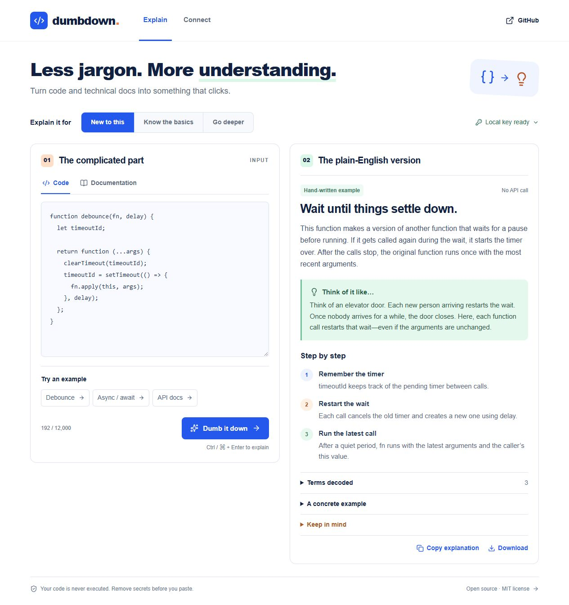

# Browser migration verification

September 30, 2026: Seven existing automated checks, TypeScript checking and the production build passed locally. A real WebGPU browser run with Qwen 3 1.7B explained the array-map doubling example correctly, including `[2, 4, 6]`. Network capture recorded no paid provider requests or prompt POSTs. This is a synthetic functional check on one laptop, not a model accuracy benchmark or proof of support on all devices.

The following ledger records the earlier provider edition; its credential requirements and provider test results do not describe the current browser website.

# Verification

Verified locally on September 19, 2026 (Pacific time).

- Seven automated tests pass, including an actual MCP SDK stdio handshake and validation failure without a paid call.
- TypeScript checking, ESLint, and the production Worker build pass.
- Real OpenAI Responses calls returned schema-validated explanations. The browser button and native WebMCP tool both returned live results.
- Copying an explanation and expanding its example were checked in the browser.
- Production preview returns `local: false`, rejects missing visitor credentials with HTTP 401, and rejects a foreign Origin with HTTP 403.
- Desktop and 390px phone layouts were visually inspected. Phone layout was tested in a local iframe because the browser's viewport override was unavailable; this is not a physical-device test.

## Design review

The implementation preserves the concept's two-column workspace, strong headline, level selector, input tabs, and structured explanation. Cobalt actions, mint analogy cards and headline highlights, and orange markers implement the requested added color. The actual UI intentionally adds connection state, clear sample labeling, expandable details, download, and error handling. Mobile stacks the panels and keeps navigation within the viewport.

## Limits

The public app requires each visitor's own OpenAI API key. Local MCP and CLI require a separately configured local key. No Discord/Telegram bot or native mobile app is included. WebMCP is experimental and browser support varies. AI explanations are not correctness proofs, and code is never executed.

See [GitHub Actions](https://github.com/agammann/dumbdown/actions) for the current commit's automated checks. Local checks are separate from hosted availability.
